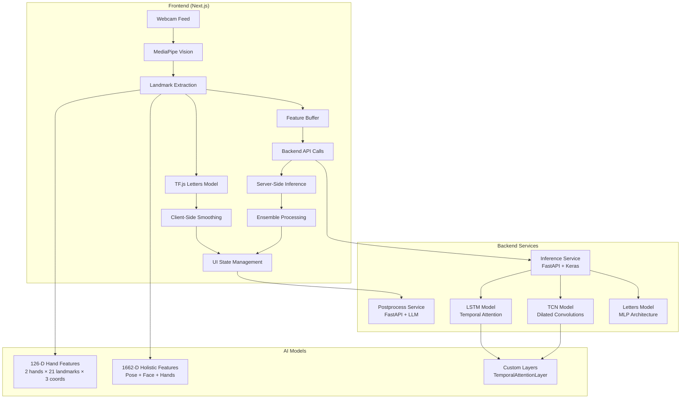

# 🤟 ISL to Real-Time Text WebApp

<div align="center">


**A comprehensive web application that converts Indian Sign Language (ISL) gestures into real-time text using advanced AI models and computer vision.**

[🚀 Live Demo](https://isl-text-app.vercel.app) • [📖 Documentation](#-documentation) • [🤝 Contributing](#-contributing) • [🐛 Report Bug](https://github.com/Abdullah-426/ISLtoRealTimeText-WebApp/issues)

</div>

---

## ✨ Features

### 🎯 Core Capabilities
- **Real-time Sign Language Recognition**: Convert ISL gestures to text instantly
- **Multi-Modal Support**: Individual letters (A-Z, 1-9) and complete phrases
- **Privacy-First Design**: Client-side landmark detection, no video uploads
- **Ensemble Learning**: Combines LSTM, TCN, and MLP models for accuracy
- **Natural Language Processing**: LLM-powered text normalization and enhancement

### 🚀 Advanced Features
- **Hold-to-Commit Logic**: Prevents spurious predictions with confidence thresholds
- **Smoothing Algorithms**: Exponential moving average for stable real-time output
- **Quality Gating**: Presence ratio and entropy checks for robust recognition
- **Modern UI/UX**: Beautiful dark theme with interactive components
- **Export Functionality**: Download transcripts and processed text

### 🔧 Technical Highlights
- **Client-Side Processing**: TensorFlow.js for letters, MediaPipe for landmarks
- **Server-Side Inference**: FastAPI services for phrase recognition
- **Custom ML Layers**: Temporal attention mechanisms for sequence modeling
- **Real-time Performance**: <100ms latency with 25-30 FPS processing
- **Cross-Platform**: Works in any modern browser with webcam support

---

## 🏗️ Architecture

<div align="center">



</div>

### 🎨 Frontend Stack
- **Framework**: Next.js 14 with TypeScript and Tailwind CSS
- **Computer Vision**: MediaPipe Tasks Vision for landmark detection
- **Machine Learning**: TensorFlow.js for client-side letter recognition
- **State Management**: Zustand for reactive application state
- **UI Components**: Custom components with modern design patterns
- **Animations**: Framer Motion for smooth interactions

### ⚙️ Backend Stack
- **API Framework**: FastAPI with automatic OpenAPI documentation
- **ML Framework**: TensorFlow/Keras with custom layer support
- **Model Serving**: Optimized inference with test-time augmentation
- **Post-processing**: Multi-provider LLM integration (OpenAI, Groq, Local)
- **Deployment**: Railway for scalable backend services

### 🧠 AI Models
- **Letters Model**: Multi-layer perceptron (126-D hand landmarks)
- **LSTM Model**: Bidirectional LSTM with temporal attention (1662-D holistic features)
- **TCN Model**: Temporal Convolutional Network with residual connections
- **Ensemble Strategy**: Weighted combination with temperature scaling

---

## 📁 Project Structure

```
ISLtoRealTimeText App v2/
├── 📱 frontend/                    # Next.js frontend application
│   ├── app/                       # Next.js 14 app directory
│   │   ├── globals.css            # Global styles and dark theme
│   │   ├── layout.tsx             # Root layout component
│   │   └── page.tsx              # Home page with hero section
│   ├── components/                # React components
│   │   ├── ui/                   # Base UI components
│   │   ├── WebcamPane.tsx        # Camera interface with MediaPipe
│   │   ├── TopK.tsx              # Prediction display component
│   │   ├── TypedBar.tsx          # Transcript and processed text
│   │   └── SettingsModal.tsx     # Configuration interface
│   ├── lib/                      # Utility libraries
│   │   ├── store.ts              # Zustand state management
│   │   ├── vision.ts             # MediaPipe integration
│   │   ├── tf_letters.ts         # TensorFlow.js letters model
│   │   └── smoothing.ts          # Real-time smoothing algorithms
│   └── public/models/letters/    # TF.js model files
├── 🔧 services/                   # Backend microservices
│   ├── infer/                    # Model inference service
│   │   ├── main.py              # FastAPI application
│   │   ├── custom_layers.py     # Custom Keras layers
│   │   └── requirements.txt     # Python dependencies
│   └── postprocess/             # Text postprocessing service
│       ├── main.py              # FastAPI application
│       ├── llm_client.py        # LLM provider integration
│       └── requirements.txt     # Python dependencies
├── 🤖 models/                     # Trained ML models
│   ├── isl_v5_lstm_mild_aw_deltas/  # LSTM phrase model
│   ├── isl_v5_tcn_deltas/           # TCN phrase model
│   └── isl_wcs_raw_aug_light_v2/   # Letters MLP model
├── 📜 scripts/                    # Development and deployment scripts
├── 🏗️ infra/                      # Infrastructure configuration
└── 📚 Project_History/           # Comprehensive project documentation
```

---

## 🛠️ Installation & Setup

### Prerequisites
- **Node.js** 18+ and npm
- **Python** 3.8+
- **Git**
- **Webcam** for real-time recognition

### 1. Clone the Repository
```bash
git clone https://github.com/Abdullah-426/ISLtoRealTimeText-WebApp.git
cd ISLtoRealTimeText-WebApp
```

### 2. Frontend Setup
```bash
cd frontend
npm install
```

### 3. Backend Setup
```bash
# Inference Service
cd services/infer
python -m venv .venv
source .venv/bin/activate  # Linux/Mac
# or
.venv\Scripts\activate     # Windows
pip install -r requirements.txt

# Postprocessing Service
cd ../postprocess
python -m venv .venv
source .venv/bin/activate  # Linux/Mac
# or
.venv\Scripts\activate     # Windows
pip install -r requirements.txt
```

### 4. Environment Configuration
Create `.env.local` in the frontend directory:
```env
# Backend Service URLs
NEXT_PUBLIC_INFER_URL=http://localhost:8001
NEXT_PUBLIC_POSTPROCESS_URL=http://localhost:8000

# Optional: LLM Provider Configuration
LLM_PROVIDER=groq
GROQ_API_KEY=your_groq_api_key_here
OPENAI_API_KEY=your_openai_api_key_here
```

---

## 🚀 Running the Application

### Development Mode

#### Option 1: Automated Start (Recommended)
```bash
# Windows PowerShell
.\scripts\start-dev.ps1

# Linux/Mac
./scripts/start-dev.sh
```

#### Option 2: Manual Start
```bash
# Terminal 1: Backend Services
cd services/infer
source .venv/bin/activate  # or .venv\Scripts\activate on Windows
uvicorn main:app --host 0.0.0.0 --port 8001

# Terminal 2: Postprocessing Service
cd services/postprocess
source .venv/bin/activate  # or .venv\Scripts\activate on Windows
uvicorn main:app --host 0.0.0.0 --port 8000

# Terminal 3: Frontend
cd frontend
npm run dev
```

### Access Points
- **Frontend Application**: http://localhost:3000
- **Inference API**: http://localhost:8001
- **Postprocessing API**: http://localhost:8000
- **API Documentation**: http://localhost:8001/docs

---

## 🎯 Usage Guide

### Getting Started
1. **Open the Application**: Navigate to http://localhost:3000
2. **Enable Camera**: Click "Start Camera" to begin webcam feed
3. **Select Recognition Mode**: 
   - **Letters**: Individual letter recognition (A-Z, 1-9)
   - **Phrases**: Complete phrase recognition
   - **Ensemble**: Combined model predictions
4. **Perform Signs**: Make ISL gestures in front of the camera
5. **View Predictions**: See real-time predictions in the "Top Predictions" section
6. **Commit Text**: Hold gestures for 3 seconds to commit them to the transcript

### Advanced Features
- **Settings Panel**: Adjust confidence thresholds, hold duration, and smoothing parameters
- **Export Functionality**: Download raw transcripts and processed text
- **Real-time Visualization**: See landmark detection overlay on camera feed
- **Performance Metrics**: Monitor FPS and processing latency

### Best Practices
- **Lighting**: Ensure good lighting conditions for optimal landmark detection
- **Distance**: Maintain 1-2 feet distance from the camera
- **Background**: Use a contrasting background for better hand detection
- **Gesture Clarity**: Make clear, deliberate gestures for better recognition

---

## 🔧 Technical Deep Dive

### Hand Landmark Processing
- **Input**: 126-dimensional feature vector (2 hands × 21 landmarks × 3 coordinates)
- **Preprocessing**: 
  - Wrist-center normalization (`wcs_fn`)
  - Scale invariance based on hand span
  - Presence masking for missing hands (`pres_fn`)
- **Custom Layers**: Temporal attention mechanisms for sequence modeling

### Model Architecture Details
- **Letters MLP**: 
  - Input: 126-D hand features
  - Architecture: Dense(256) → ReLU → Dropout(0.3) → Dense(128) → ReLU → Dense(36) → Softmax
  - Classes: A-Z, 1-9, blank (36 total)

- **LSTM Phrase Model**:
  - Input: 1662-D holistic features (Pose 33×4 + Face 468×3 + Hands 21×3×2)
  - Architecture: BiLSTM → TemporalAttentionLayer → Dense → Softmax
  - Sequence Length: 48 frames (~1.6s at 30fps)

- **TCN Phrase Model**:
  - Input: Same 1662-D features
  - Architecture: Dilated temporal convolutions → Global Average Pooling → Dense → Softmax
  - Benefits: Faster inference, better temporal receptive fields

### Real-time Processing Pipeline
1. **MediaPipe Detection**: Hand, pose, and face landmark extraction
2. **Feature Extraction**: Convert landmarks to normalized feature vectors
3. **Client-Side Smoothing**: Exponential moving average for stable predictions
4. **Quality Gating**: Presence ratio and entropy checks
5. **Commit Logic**: Hold-to-commit with confidence thresholds
6. **Post-processing**: LLM-powered text normalization

### Performance Optimizations
- **Frame Stride**: Process every 2nd frame for phrases to reduce computational load
- **Feature EMA**: Smooth input features before model inference
- **Client-Side Processing**: Letters recognition runs entirely in browser
- **Batch Processing**: Efficient handling of sequence data
- **Memory Management**: Optimized tensor operations and cleanup

---

## 📊 Model Performance & Benchmarks

### Accuracy Metrics
- **Letters Recognition**: 
  - Training Accuracy: 95%+
  - Validation Accuracy: 90%+
  - Real-time Stability: Excellent with smoothing

- **Phrase Recognition**:
  - LSTM Model: Good performance on smooth, clear gestures
  - TCN Model: Robust to temporal variations
  - Ensemble: Improved stability across diverse conditions

### Performance Metrics
- **Inference Latency**: <100ms for letters, 200-500ms for phrases
- **Frame Rate**: 25-30 FPS on modern laptops
- **Memory Usage**: <500MB for frontend, <1GB for backend services
- **CPU Usage**: Moderate (30-50% on single core)

### Robustness Features
- **Lighting Adaptation**: Works in various lighting conditions
- **Background Independence**: Robust to different backgrounds
- **Occlusion Handling**: Graceful degradation with partial hand visibility
- **Distance Tolerance**: Works at 1-3 feet from camera

---

## 🚀 Deployment

### Production Deployment (Vercel + Railway)

#### Frontend (Vercel)
```bash
cd frontend
npm run build
vercel --prod
```

#### Backend Services (Railway)
```bash
# Deploy inference service
cd services/infer
railway deploy --service inference

# Deploy postprocessing service
cd ../postprocess
railway deploy --service postprocess
```

### Environment Variables
```env
# Production Environment
NEXT_PUBLIC_INFER_URL=https://inference-service.railway.app
NEXT_PUBLIC_POSTPROCESS_URL=https://postprocess-service.railway.app

# LLM Configuration
LLM_PROVIDER=groq
GROQ_API_KEY=your_production_api_key
```

### Docker Deployment
```bash
# Build and run with Docker Compose
docker-compose up --build
```

---

## 🧪 Testing

### Running Tests
```bash
# Backend Tests
cd services/infer
python -m pytest tests/

# Frontend Tests
cd frontend
npm run test

# Integration Tests
npm run test:integration
```

### Test Coverage
- **Unit Tests**: Model inference, API endpoints, utility functions
- **Integration Tests**: End-to-end workflow testing
- **Performance Tests**: Latency and throughput benchmarks
- **Browser Tests**: Cross-browser compatibility

---

## 🤝 Contributing

We welcome contributions! Please see our [Contributing Guidelines](CONTRIBUTING.md) for details.

### Development Workflow
1. **Fork** the repository
2. **Create** a feature branch (`git checkout -b feature/amazing-feature`)
3. **Commit** your changes (`git commit -m 'Add some amazing feature'`)
4. **Push** to the branch (`git push origin feature/amazing-feature`)
5. **Open** a Pull Request

### Areas for Contribution
- **Model Improvements**: Better accuracy, new architectures
- **UI/UX Enhancements**: Improved user experience
- **Performance Optimization**: Faster inference, lower latency
- **Documentation**: Better guides, tutorials, examples
- **Testing**: More comprehensive test coverage
- **Accessibility**: Better support for users with disabilities

---

## 📝 License

This project is licensed under the MIT License - see the [LICENSE](LICENSE) file for details.

---

## 👥 Team & Creators

<div align="center">

| **Abdullah Ansari** | **Aryan Tayal** | **Pranav Bansal** | **Devyansh Kirar** |
|:---:|:---:|:---:|:---:|
| Lead Developer | Developer | Developer | Developer |
| Full-stack & ML | Frontend & UI | Backend & ML | DevOps & Testing |

</div>

### Acknowledgments
- **MediaPipe Team** for computer vision capabilities
- **TensorFlow Team** for ML framework and TensorFlow.js
- **Next.js Team** for the amazing React framework
- **FastAPI Team** for the high-performance API framework
- **All Contributors** and testers who helped improve the project

---

## 📞 Support & Community

### Getting Help
- **GitHub Issues**: [Report bugs or request features](https://github.com/Abdullah-426/ISLtoRealTimeText-WebApp/issues)
- **Discussions**: [Join community discussions](https://github.com/Abdullah-426/ISLtoRealTimeText-WebApp/discussions)
- **Documentation**: [Comprehensive project documentation](Project_History/)

### Community Guidelines
- Be respectful and inclusive
- Help others learn and grow
- Share knowledge and experiences
- Contribute to making ISL recognition more accessible

---

## 🔮 Roadmap & Future Work

### Short Term (Next 3 months)
- [ ] **Mobile PWA**: Progressive Web App for mobile devices
- [ ] **Offline Mode**: Complete offline functionality
- [ ] **More Languages**: Support for Hindi and regional ISL variants
- [ ] **Performance**: WebGPU acceleration for faster inference

### Medium Term (3-6 months)
- [ ] **Advanced Grammar**: Context-aware grammar modeling
- [ ] **Facial Expressions**: Integration of facial expression recognition
- [ ] **Multi-Person**: Support for multiple signers
- [ ] **Custom Models**: User-specific model fine-tuning

### Long Term (6+ months)
- [ ] **Native Apps**: iOS and Android applications
- [ ] **Enterprise Features**: Meeting transcription, accessibility tools
- [ ] **Educational Platform**: Learning management system integration
- [ ] **Research Collaboration**: Academic partnerships and publications

---

<div align="center">

**🌟 If you find this project helpful, please give it a star!**

[](https://github.com/Abdullah-426/ISLtoRealTimeText-WebApp/stargazers)
[](https://github.com/Abdullah-426/ISLtoRealTimeText-WebApp/network)

**Made with ❤️ for the deaf and hard-of-hearing community**

</div>
